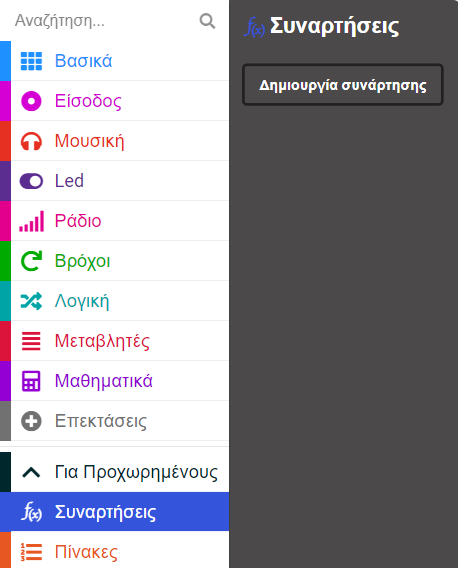
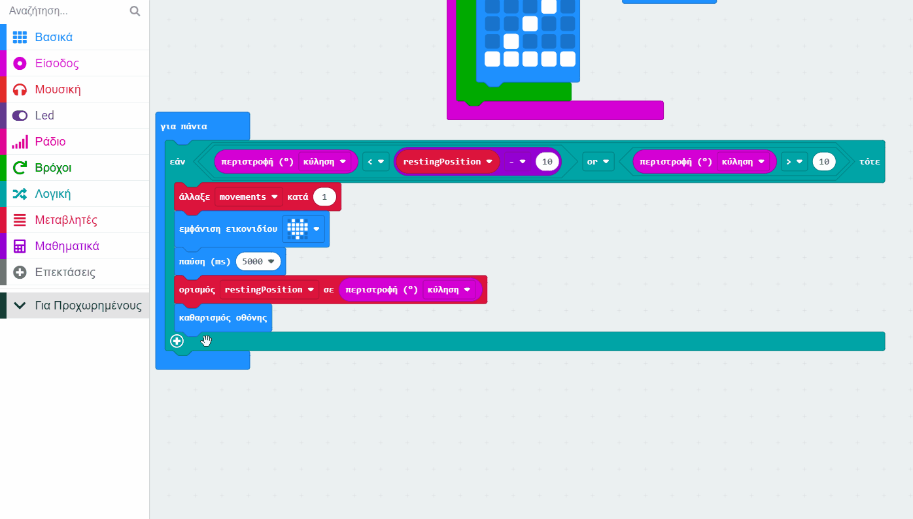

Η επανάληψη μιας μεγάλης ομάδας μπλοκ κάνει τον κώδικά μας ακατάστατο.

Εάν χρειάζεται να χρησιμοποιήσεις ξανά κάποιον κώδικα, είναι καλύτερα να τον τοποθετήσεις σε μια συνάρτηση και μετά να «καλέσεις» τη συνάρτηση να εκτελεστεί.

Μια συνάρτηση είναι μια ομάδα μπλοκ που έχεις δημιουργήσει και ονομάσει. Μπορείς να εκτελέσεις αυτά τα μπλοκ «καλώντας» το όνομα της συνάρτησης. Μια άλλη λέξη για μια συνάρτηση είναι ένα υποπρόγραμμα, επειδή μπορεί να κληθεί να εκτελεστεί από το κύριο πρόγραμμα.

## Για να δημιουργήσεις μια συνάρτηση

Μπορείς να βρεις τα μπλοκ "Συναρτήσεις"{:class='microbitfunctions'} στο μενού "Για προχωρημένους" στην Εργαλειοθήκη σου.

Κάνε κλικ στο μενού "Συναρτήσεις"{:class='microbitfunctions'} και, στη συνέχεια, κάνε κλικ στο "Δημιουργία Συνάρτησης".

Ονομάσε τη συνάρτηση και κάνε κλικ στο **Ολοκλήρωση**. Τώρα μπορείς να προσθέσεις μπλοκ κώδικα στη συνάρτησή σου.

Ο κώδικας στη συνάρτησή σου δεν θα τρέξει μέχρι να τον 'καλέσεις'.

## Για να καλέσεις μια συνάρτηση

Από το μενού `Συναρτήσεις`{:class='microbitfunctions'}, σύρε προς τα έξω το μπλοκ `κλήση`{:class='microbitfunctions'} για τη συνάρτησή σου και τοποθέτησε το στο σημείο που θέλεις να εκτελεστεί η συνάρτησή σου.
