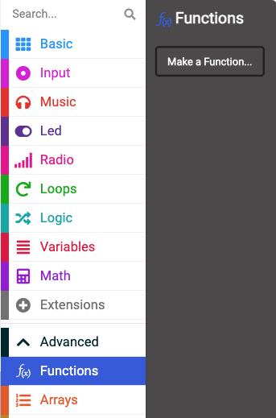
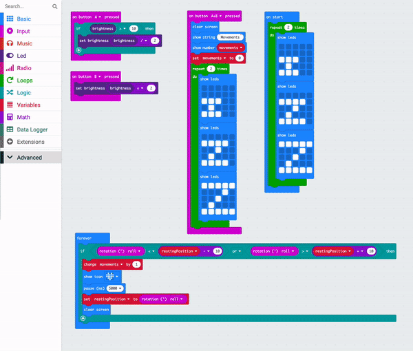

Repeating a large group of blocks makes our code untidy.

If you need to re-use code, it is better to put it in a function and then 'call' the function to run. 

A function is a group of blocks that you have created and named. You can run those blocks by 'calling' the name of the function. Another word for a function is a subprogram, because it can be called to run from the main program.

## To create a function

You can find the `Functions`{:class='microbitfunctions'} blocks in the Advanced menu in your Toolbox.

Click the `Functions`{:class='microbitfunctions'} menu and then click `Make a Function`.

Name the function.

The code in your function will not run until you 'call' it.

## To call a function

From the `Functions`{:class='microbitfunctions'} menu, drag out the `call`{:class='microbitfunctions'} block for your function and place it where you want your function to run.
