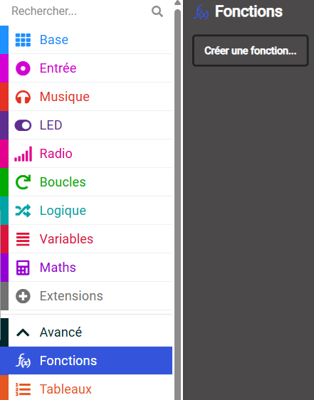
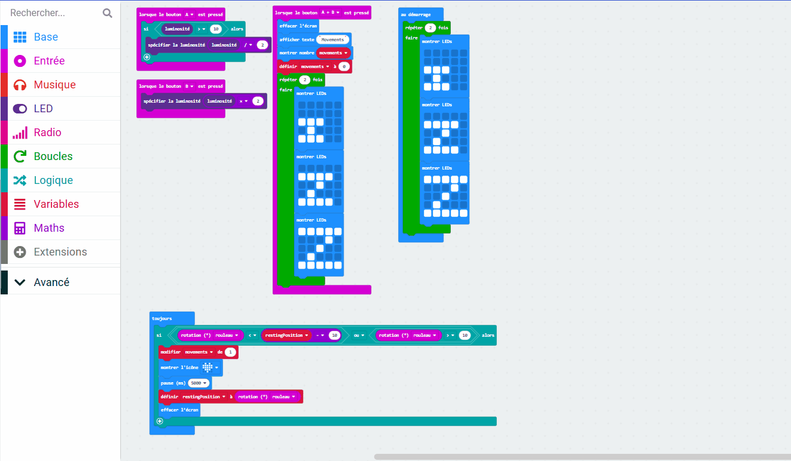

La répétition d’un grand groupe de blocs rend notre code désordonné.

Si tu dois réutiliser du code, il est préférable de le placer dans une fonction, puis d'« appeler » la fonction pour l'exécuter.

Une fonction est un groupe de blocs que tu as créés et nommés. Tu peux exécuter ces blocs en « appelant » le nom de la fonction. Un autre mot pour une fonction est un sous-programme, car il peut être appelé pour s'exécuter à partir du programme principal.

## Pour créer une fonction

Tu peux trouver les blocs `Fonctions`{:class='microbitfunctions'} dans le menu Avancé dans ta boîte à outils.

Clique sur le menu `Fonctions`{:class='microbitfunctions'}, puis clique sur `Créer une fonction`.

Nomme la fonction et clique sur **Terminé**. Tu peux maintenant ajouter des blocs de code à ta fonction.

Le code de ta fonction ne s'exécutera pas avant de l'appeler.

## Pour appeler une fonction

Dans le menu `Fonctions`{:class='microbitfunctions'}, fais glisser le bloc `appeler`{:class='microbitfunctions'} pour ta fonction et place-la là où tu veux que ta fonction s'exécute.
