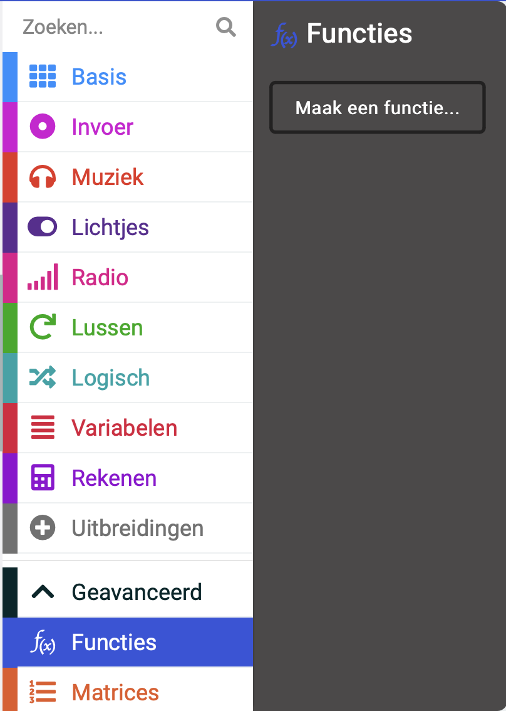
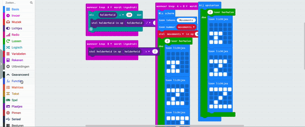

Het herhalen van een grote groep blokken maakt onze code rommelig.

Als je code opnieuw moet gebruiken, is het soms beter om deze in een functie te zetten en vervolgens de functie 'aan te roepen' om te draaien.

Een -functie is een groep blokken die je kunt maken en een naam kunt geven. Je kunt deze blokken uitvoeren door de naam van de functie 'aan te roepen'. Een ander woord voor een functie is een subprogramma, omdat het kan worden uitgevoerd vanuit het hoofdprogramma.

## Maak een functie

Je kunt de `Functies`{:class='microbitfunctions'} blokken vinden in het geavanceerde menu in je Toolbox.

Klik op de `Functies`{:class='microbitfunctions'} menu en klik vervolgens op `Maak een functie`.

Geef de functie een naam en klik op **Klaar**. Je kunt nu codeblokken toevoegen aan je functie.

De code in je functie wordt pas uitgevoerd als je deze 'aanroept'.

## Roep een functie aan

Vanuit het `Functies`{:class='microbitfunctions'} menu sleep je het `aanroep`{:class='microbitfunctions'} blok voor je functie en plaats je het daar waar je wilt dat je functie werkt.
